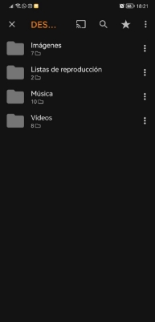

**SERVIDOR MULTIMEDIA**

 

**PARA PC, ANDROID, TV, ETC**

**1.Requisitos previos**

Para hacer este servidor se ha utilizado:

1. **Windows 10 como sistema operativo.**
1. 4GB de RAM
1. Disco duro interno de 130GB
1. Disco duro externo de 1TB
2. **Reproductor VLC.** Tanto en ordenador como en tele fono, para reproducir el contenido del servidor.

**2.Configuraciones.**

Para compartir el contenido en nuestro equipo tenemos que configurar la red de Windows 10, hacemos lo siguiente:

1. En el panel de tareas accedemos a conexio n de red y entramos en el menu  de configuracio n.

2. Vamos a Centro de redes y recursos compartidos, y en la nueva ventana abrimos Cambiar configuracio n de uso compartido avanzado (en la parte izquierda de la ventana).

Aquí  tendremos 3 tipos de perfiles de red, privado, invitado o pu blico, y todas las redes, aplicamos la siguiente configuracio n:

- **Perfil privado:**

- **Perfil invitado o público.** Se puede dejar como viene por defecto.

- **Todas las redes.**

A continuacio n, en el perfil de todas las redes, entramos en “Elegir opciones de transmisio n por secuencias de multimedia” y activamos la transmisio n multimedia haciendo click en el boto n “Activar la transmisio n por secuencias de multimedia”.

Si se cierra la ventana, entramos de nuevo en la opcio n mencionada, tenemos que ver lo siguiente:

Aquí  podemos darle un nombre a nuestro servidor multimedia, y permitir el acceso a los dispositivos que queramos, en el apartado mostrar dispositivos en red lo ponemos en red local para que solo se vean los dispositivos de nuestra red.

Damos en aceptar y podemos cerrar la ventana de configuracio n de red

**3.Preparar el contenido que queremos compartir.**

Creamos una carpeta donde colocar todo lo que vayamos a ver ma s adelante, ya sean ima genes, películas, series, mu sica… En mi caso he utilizado un disco duro externo con dos carpetas, una para las series y otra para las películas. 

Le damos permisos a las carpetas para poder acceder a ellas sin necesidad de iniciar sesio n en los dispositivos ni nada, hacemos clic derecho en la carpeta y seguimos la imagen:

En la nueva ventana, agregamos el grupo Todos si no aparece en la lista de usuarios, y le aplicamos permisos de solo lectura en caso de que lo queramos así. 

Le damos a compartir, y a continuacio n a listo.

Hacemos lo mismo para todas las carpetas con las que vayamos a compartir algo con nuestro servidor.

Ahora agregamos esas carpetas en nuestra biblioteca, hacemos clic derecho encima de la carpeta  y  vamos  al  apartado  Incluir  en  biblioteca,  seleccionamos  la  biblioteca  que corresponda con la carpeta:

Podemos comprobar que se ha an adido el contenido que queremos abriendo el explorador de archivos, clic derecho en un espacio en blanco de la parte izquierda, mostrar bibliotecas:

Y entramos en la biblioteca de medios que queramos:

Dentro deberemos ver todo lo que haya dentro de las carpetas del servidor como en la imagen:

En mi caso, sale el contenido del disco duro externo (E:) porque son las películas y series que hay en el disco duro.

**4.Como ver el contenido.**

Esta seccio n se dividira  dependiendo del dispositivo en donde queramos ver el contenido, de forma  general,  tendremos  que  abrir  el  explorador  de  archivos  de  nuestro  dispositivo, conectarnos al servidor, entrar en el tipo de contenido que vamos a seleccionar (videos, musica, imagenes, etc) y entrar en la carpeta llamada Carpetas, que contiene todo lo que queremos que el servidor muestre. 

- **Android.** Con VLC, entramos en la aplicacio n  

y vamos al apartado Explorar, buscamos el  nombre de nuestro equipo y entramos  

en e l, en mi caso, el pc se llama DESKTOP-1CLHOIE. 

Entramos y vamos a la carpeta multimedia que  queramos ver,  dentro de  esta,  entramos  en  Carpetas  para  ver  la  carpeta  que  hemos  compartido,  y  una  vez  dentro,  podremos ver todo lo que hemos incluido en  la biblioteca. 

 

 

- **En otro ordenador.**   Abrimos el explorador de archivos y vamos a Red, buscamos nuestro equipo:

Entramos y se abrira  el reproductor de Windows, en la parte izquierda buscamos el nombre de nuestro servidor multimedia, y elegimos el tipo de contenido que queremos ver.

- **Enviar contenido a Chromecast.** Instalamos el reproductor VLC en el ordenador servidor y lo ejecutamos, en la parte superior del programa vamos a Reproduccio n y en el apartado Procesador seleccionamos el dispositivo en el que queremos reproducir el contenido.

Esperamos unos minutos para que se establezca la conexio n e iniciamos lo que queramos que se reproduzca yendo a Medio, y Abrir archivo.

En ocasiones, en cualquier dispositivo la reproduccio n puede quedarse colgada si saltamos mucho en los segmentos de reproduccio n (adelantar o rebobinar), en caso de que ocurra, nos desconectamos del servidor por completo y nos volvemos a conectar.
Pedro Angel Castiñeira Ruiz Servidor multimedia local 10
